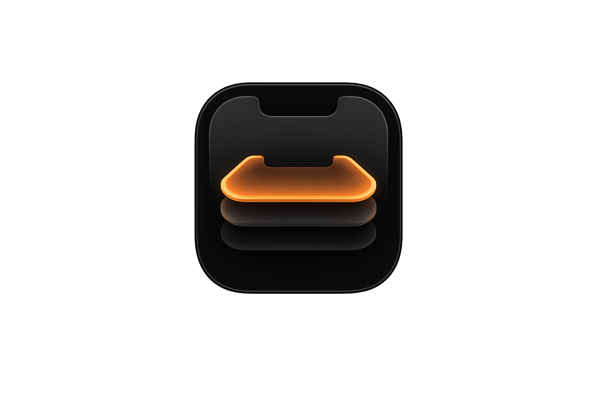
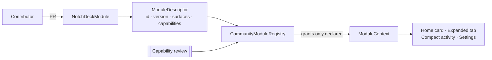

<div align="center">
  

  # NotchDeck

  **Turn your MacBook notch into a focused workspace for everyday tools and coding agents.**

  Native macOS · Swift · SwiftUI · AppKit · macOS 14+

  <sub>⚠️ Early-stage / in active development — not yet a stable 1.0 release.</sub>
</div>

---

NotchDeck turns the area around the notch into an interactive surface. It is
compact and near-invisible at rest, matching the physical notch, and expands
smoothly on hover, click, or file drag. On notch-less displays it centers a
small pill at the top of the screen.

Two faces:

- **Utilities** — Quick Note, Now Playing, File Shelf, Mirror, Pomodoro Focus,
  Downloads activity, and screenshots, as customizable Home modules.
- **Agents** — monitor Claude Code and Codex sessions, handle real permission
  requests, and jump to the existing Terminal tab where a session runs.

No private APIs. No screen scraping for core features. Everything stays local.

## Screenshots

> Screenshots are not yet included. See
> [`docs/screenshots/`](docs/screenshots/README.md) for the exact filenames to
> add — they were intentionally not invented.

<table>
  <tr>
    <td align="center"><b>Home</b><br/><sub>docs/screenshots/home.png</sub></td>
    <td align="center"><b>Focus</b><br/><sub>docs/screenshots/focus.png</sub></td>
  </tr>
  <tr>
    <td align="center"><b>Files</b><br/><sub>docs/screenshots/files.png</sub></td>
    <td align="center"><b>Agents</b><br/><sub>docs/screenshots/agents.png</sub></td>
  </tr>
</table>

## Features

- **Notch expansion + compact live activities** — physical-idle, compact
  activity capsule, and expanded panel, with content shown only when relevant.
- **Quick Note** — a sticky note on Home.
- **Now Playing** — current track + transport controls (Music / Spotify).
- **File Shelf** — drag files in to stage them (move-into-shelf or
  keep-reference), drag out to move/copy; crash-safe manifest.
- **Mirror** — a live camera preview (never recorded, never sent anywhere).
- **Pomodoro Focus** — timestamp-based timer with a four-slice cycle and a
  responsive horizontal/vertical dashboard.
- **Downloads** — shows only in-progress downloads and files completed **today**.
- **Screenshots** — capture the screen from the Files tab.
- **Agents** — Claude Code / Codex session monitoring via installed hooks,
  Active vs Recent by terminal presence, provider logos, real approval handling,
  and **Focus Terminal** (raise the existing tab).
- **Customizable Home** — reorder, resize, show/hide modules; layout presets.

Experimental / incremental:

- The **community module architecture** (below) is implemented and tested; not
  every shipped widget is migrated onto it yet.

## Requirements

Read from `project.yml`:

- **macOS 14.0+** (deployment target).
- **Swift 5** language mode.
- **Xcode 15+** to build (developed with a newer Xcode).
- **[XcodeGen](https://github.com/yonabc/XcodeGen)** to generate the project
  from `project.yml` (`brew install xcodegen`). The generated `.xcodeproj` is
  git-ignored; `project.yml` is authoritative.
- Optional, for Agents: the [`claude`](https://docs.anthropic.com/claude-code)
  and/or [`codex`](https://github.com/openai/codex) CLIs.

Permissions used (requested only when the feature is used, or via the
first-launch Permissions Setup): **Camera** (Mirror), **Screen Recording**
(screenshots), **Downloads folder** access, **Automation** (Focus Terminal),
**Notifications** (Pomodoro).

## Build from source

```bash
# 1. Clone
git clone https://github.com/MarazziMarco/NotchDeck.git
cd NotchDeck

# 2. Install the project generator (project.yml is authoritative)
brew install xcodegen

# 3. Generate the Xcode project
xcodegen generate

# 4. Build (Debug)
xcodebuild -project NotchDeck.xcodeproj -scheme NotchDeck \
  -configuration Debug -destination 'platform=macOS' build

# 5. Run the test suite
xcodebuild -project NotchDeck.xcodeproj -scheme NotchDeck \
  -destination 'platform=macOS' test

# 6. Build a Release (unsigned, local)
xcodebuild -project NotchDeck.xcodeproj -scheme NotchDeck \
  -configuration Release -destination 'platform=macOS' build
```

Or open `NotchDeck.xcodeproj` in Xcode and run. NotchDeck is a menu-bar app
(no Dock icon by default).

## Agent Integration

Claude Code and Codex sessions **do not appear automatically** — NotchDeck does
not scan or read terminal contents. Instead, the agents emit lifecycle events
through **hooks** you install, and NotchDeck reacts to those.

- **Activity hooks** (`PreToolUse`, `PostToolUse`, `Stop`, `SessionEnd`) update a
  session's status.
- **`PermissionRequest`** — and only that — creates an approval.
- **Focus Terminal** raises the existing tab (by TTY); it never runs a command.

**Install:** NotchDeck → **Settings → Agents → Terminal integration → Install
Hooks** (Claude Code / Codex) → start a **new** session → run the self-test.
Reinstall after upgrades if the app reports a hook mismatch.

Approvals support three sequential modes — **Terminal only**, **NotchDeck only**,
and **NotchDeck, then Terminal fallback** (default). See the full guide:

➡️ **[docs/AGENT_INTEGRATION.md](docs/AGENT_INTEGRATION.md)** ·
   [Troubleshooting](docs/TROUBLESHOOTING.md)

## Community Modules

NotchDeck has a source-integrated, community-extensible module system. Built-in
modules use the same registry foundation; community modules can be proposed via
pull requests, must **declare the capabilities they use**, and are reviewed
before inclusion. **Arbitrary unsigned runtime plugins are not loaded.**



- Guide: [docs/modules/CREATING_A_MODULE.md](docs/modules/CREATING_A_MODULE.md)
- Review: [docs/modules/MODULE_REVIEW_GUIDELINES.md](docs/modules/MODULE_REVIEW_GUIDELINES.md)
- Contributing: [CONTRIBUTING.md](CONTRIBUTING.md)
- Example module:
  [`Modules/Examples/UptimeExampleModule.swift`](NotchDeck/Modules/Examples/UptimeExampleModule.swift)

## Documentation

- [Architecture](docs/ARCHITECTURE.md)
- [Agent Integration](docs/AGENT_INTEGRATION.md)
- [Troubleshooting](docs/TROUBLESHOOTING.md)
- [Modules](docs/modules/README.md)
- [Contributing](CONTRIBUTING.md) · [Security](SECURITY.md) ·
  [Code of Conduct](CODE_OF_CONDUCT.md) · [Changelog](CHANGELOG.md)

## Privacy

Local-only: no telemetry, no analytics, no cloud sync. The agent bridge is a
user-only Unix-domain socket (no network port); only sanitized event metadata
crosses it. NotchDeck never pastes commands, and Focus Terminal never creates
tabs or runs commands.

## License

[MIT](LICENSE). Provider names and marks ("Claude", "Codex", "Gemini", …) are
trademarks of their respective owners; NotchDeck is an independent project and
is not affiliated with them.
